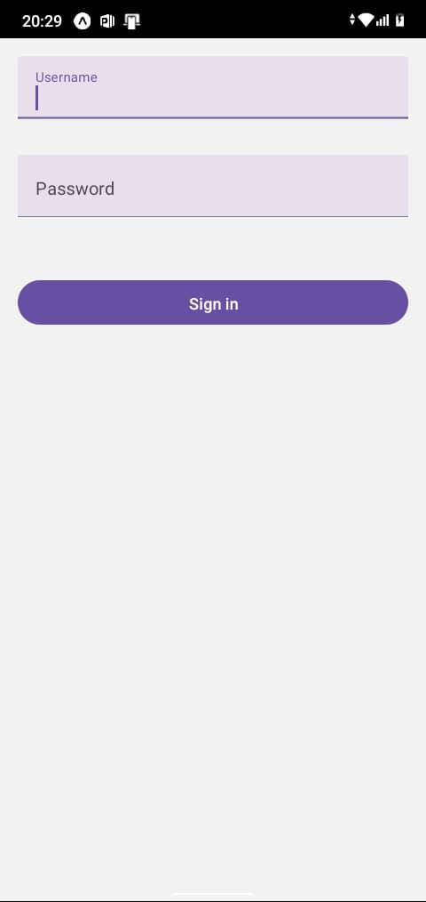
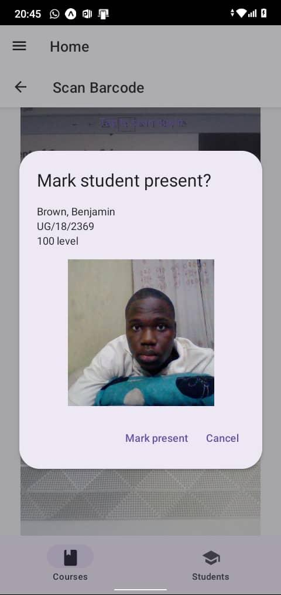
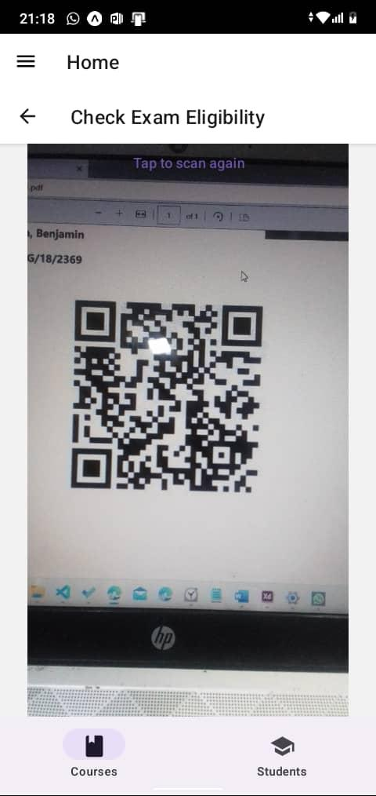
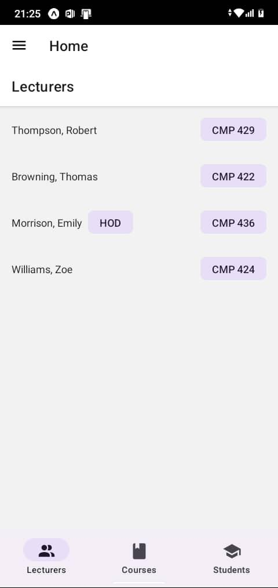
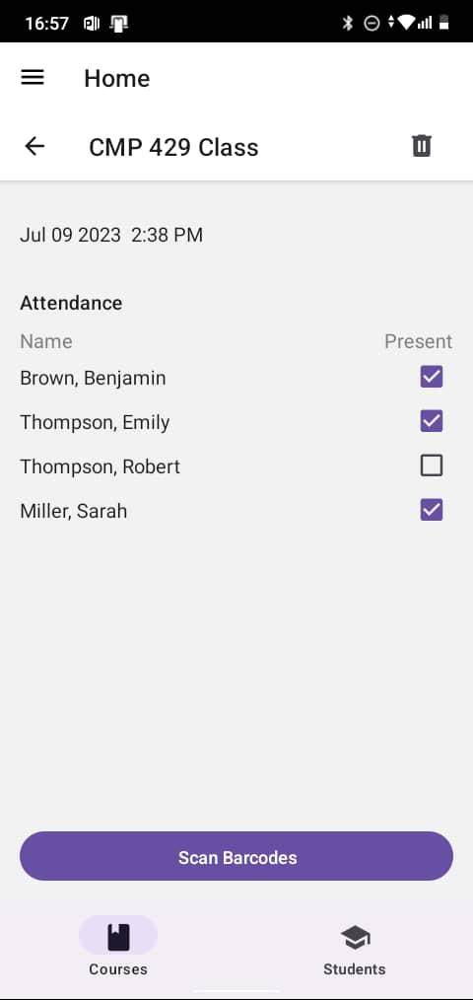
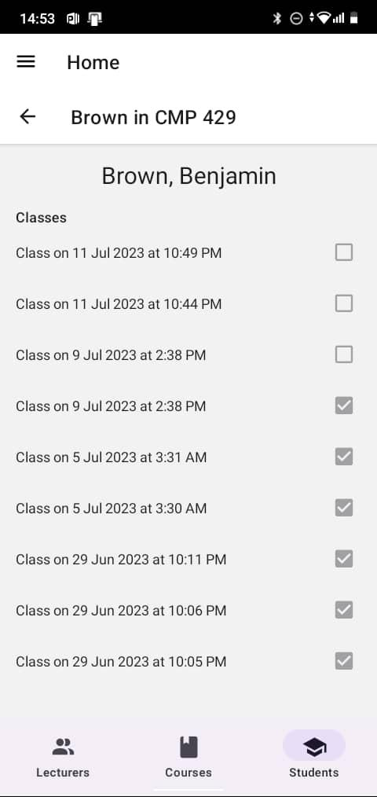
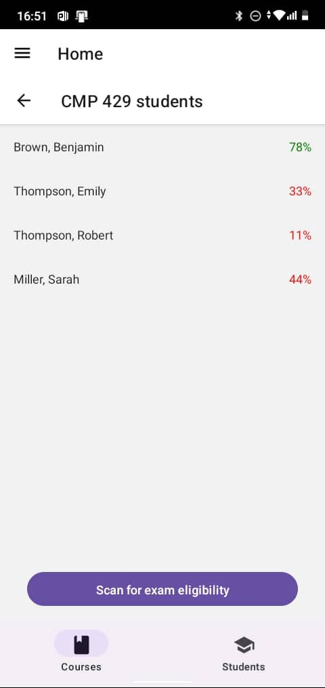
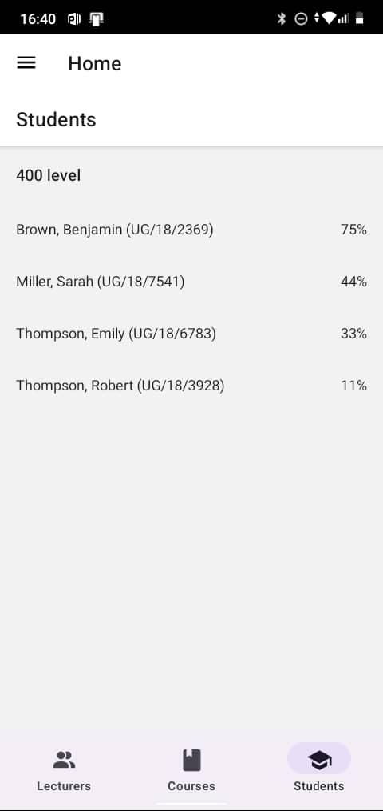

# Automated Student Attendance-Taking System With QR Code Scanner

This is the repo for the mobile app making up a part of the system.

## Screenshots

### Login Module

### Scan Barcode Module

### Check Exam Eligibility Module

### View Lecturer List Module

### View Lecturer Module

### View Course List Module

### View Class List Module

### View Class Module

### View Course Student List Module

### View Student List Module

### View Student Module

